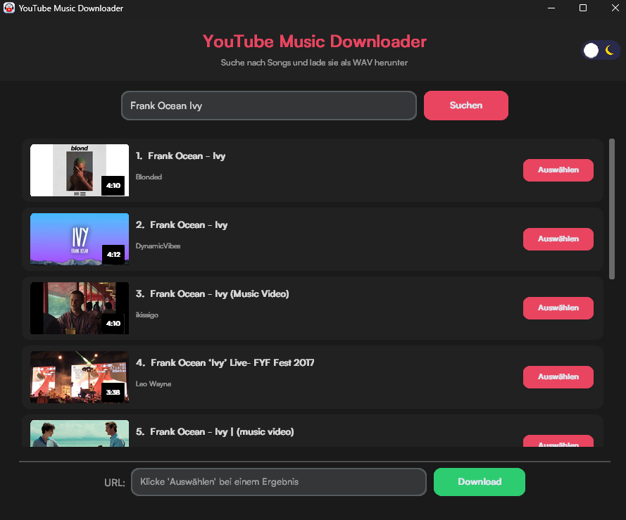

# YouTube Music Downloader

A modern desktop application to search and download audio from YouTube videos as high-quality WAV files. Built with Python and CustomTkinter, featuring a sleek dark/light theme UI with animated toggle.

---

## Preview



---

## Features

- **Song Search** — Search for any song or video by name, powered by yt-dlp
- **10 Results** — Displays up to 10 search results with thumbnails, titles, channel names and duration
- **One-Click Select** — Click "Auswählen" to pick a result for download
- **High-Quality WAV** — Downloads the best available audio and converts to uncompressed WAV (44.1 kHz, 16-bit, stereo)
- **Dark / Light Theme** — Animated theme toggle with sun/moon icons
- **Cross-Platform** — Available for Windows, macOS and Linux as standalone executables

---

## Download

Download the latest release for your platform from the [Releases](../../releases) page.

| Platform | File |
|----------|------|
| Windows  | `YT-Music-Downloader-Windows.zip` |
| macOS    | `YT-Music-Downloader-macOS.zip` |
| Linux    | `YT-Music-Downloader-Linux.zip` |

Extract the ZIP and run the executable. FFmpeg is bundled — no extra setup required.

---

## Run from Source

### Prerequisites

- Python 3.10+
- FFmpeg installed and added to your system PATH

### Installation

```bash
pip install customtkinter yt-dlp Pillow requests
```

### Start

```bash
cd YT-MP3-Downloader-main
python main.py
```

---

## How It Works

1. Enter a song name in the search bar and click **Suchen**
2. Browse the results — each card shows a thumbnail, title, channel and duration
3. Click **Auswählen** on the song you want
4. The URL is filled in automatically — click **Download**
5. The WAV file is saved to your `Downloads` folder

---

## Tech Stack

- **CustomTkinter** — Modern themed GUI toolkit
- **yt-dlp** — YouTube search and audio extraction
- **FFmpeg** — Audio conversion to WAV
- **Pillow** — Thumbnail loading and image processing
- **PyInstaller** — Cross-platform packaging as standalone executables

---

## Disclaimer

This project is for educational purposes only. Downloading copyrighted material may violate YouTube's terms of service and the laws of your country. Please use this tool responsibly and respect copyright laws.
